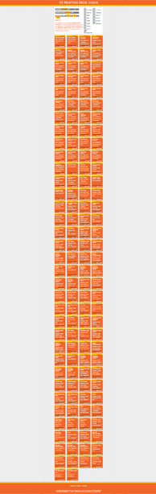

3dprintingpricecheck.com was a website for comparing prices between several 3D printing services including Shapeways, iMaterialize, Sculpteo, …
Users would “upload” an STL file by dragging it into the page.
Javascript would analyze the file in the browser (without ever sending it to a server) to extract pricing-relevant properties.
Finally, the prices for each services would be determined and displayed for a wide library of materials als finishes.
While some of the services had a pricing API, most did not and the prices were estimates based on my reverse engineering of their pricing formulas.

The site was up for several years and, at one time, included localized versions for both German and Korean visitors.
I took it offline in 2020 when the hype around 3D printing had long abated, many of the services covered had disappeared, and the others had become a lot more transparent about their pricing.
Maybe this project played a small role in causing that latter part.

One day I will write a more complete history of this project, until then I'll fill this space with an absurdly long screenshot of a results page taken from 3dprintingpricecheck.com.

