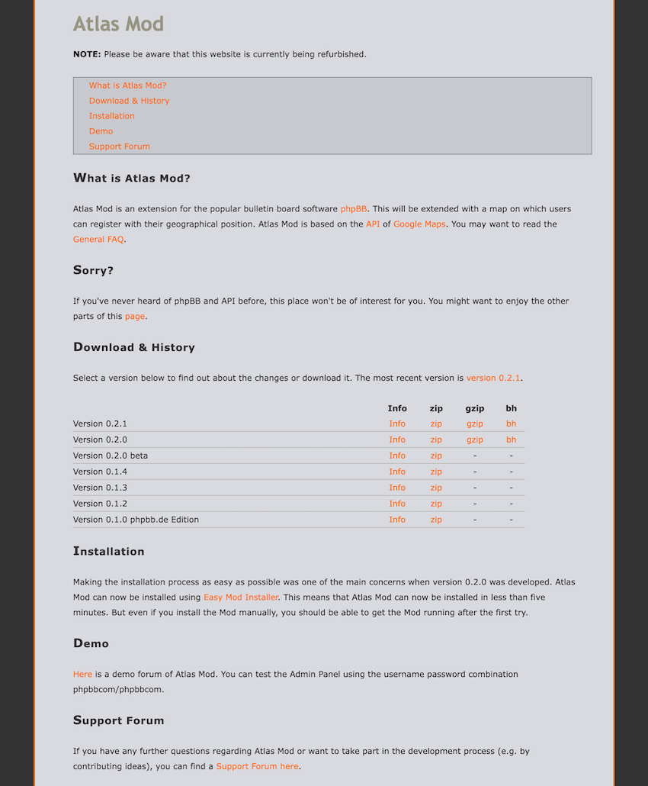
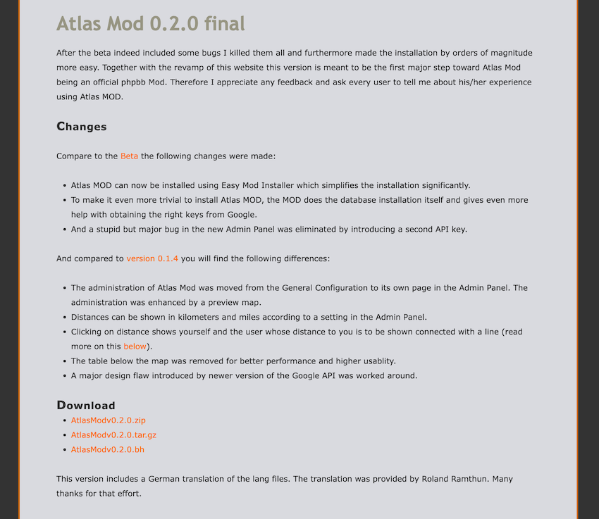

[Atlas Mod](https://www.phpbb.com/community/viewtopic.php?f=16&t=355232) was an addon for the [phpBB open source bulletin board software](https://www.phpbb.com) that embedded a user map based on Google Maps into the user directory.

The Google Maps announcement in 2005 blew my mind. 
Doing anything with maps online had been near-impossible before then and suddenly there was this new thing, built with brand-new techniques like AJAX request and tiled maps. 
Even better: It came with a free API for embedding maps in your website!

I was keen to use Google Maps for _something_ and got to work on what ended up being my first open source project.
At the time, I was in my first year of university after graduating from high school as a member of the  my newly founded school's first group of alumni.
The school's online community I had co-created had geographically distributed members (the alumni) for the first time and I had already experimented with various static user maps.
A few hundred lines of PHP later and after posting instructions for how to add your latitude/longitude to your user profile and we had an interactive user map!

Our online community was a heavily customized version of phpBB, and my next goal became to make this Google Maps integration available as an addon for other phpBB users.
[phpBB "mods" (modifications)](https://www.phpbb.com/mods/) were source code patch files that a phpBB board administrator could apply on top of the phpBB source code.
Atlas Mod was such a mod and included the user directory map, a user profile location picker widget, and admin portal tools for managing the integration and performing the initial database migration.

I maintained Atlas Mod for a year or so before I could no longer keep up with the upgrades to Google Maps API v2 and phpBB 3.0.
An early version of Atlas Mod was one of three winners of the [2005 phpbb.de MOD Contest](https://www.phpbb.de/community/viewtopic.php?t=99989) (the prize was a 15€ Amazon voucher).
In 2008 another phpBB community member with the excellent name Happy Döner [released a new version of Atlas Mod](https://www.phpbb.com/community/viewtopic.php?t=930195).
Thanks to the Internet Archive I was able to resurrect the screenshots of the Atlas Mod website below, but sadly none of Atlas Mod itself.

