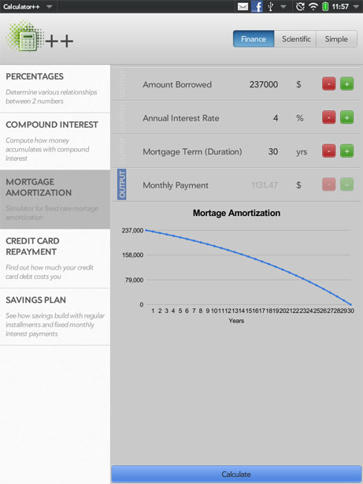

# Calculator App for webOS

When the HP Touchpad was still new and webOS wasn't completely dead yet, [Conny](http://www.corneliascheitz.com) and I created a series of calculator apps for webOS.
The Touchpad came without a preloaded calculator app, so we gave a basic calculator away for free with in-app upgrade options for our more specialized creations.
The whole thing ran under the name [Calculator++](https://developer.palm.com/appredirect/?packageid=com.minderleister.calculatorplusplus 'Calculator++ for webOS') and taught me a lot about floating point errors.
A lot.

Over time we put together a
[scientific](https://developer.palm.com/appredirect/?packageid=com.minderleister.calculatorscientific)

… and a
[personal finance](https://developer.palm.com/appredirect/?packageid=com.minderleister.calculatorfinancial) calculator app.

We like to think that somebody probably found these a useful educational tool, but in the end the biggest educational effect might have been on us by teaching us about the quirks of Javascript and the webOS framework.
