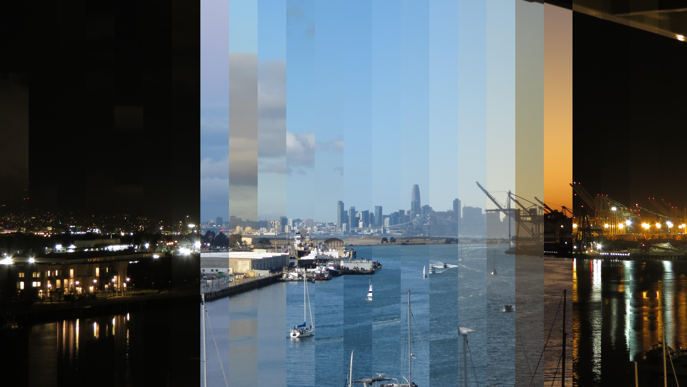



After moving into a new apartment with an amazing view of the Port of Oakland and San Francisco in the distance, Conny and I decided to use our new balcony for a little photography project. Using our old Canon SX40 HS point and shoot camera we set up a time lapse setup.

Starting in July 2021, we've been posting a daily timelapse to the project's [Twitter account](https://twitter.com/cranesandclouds) and [Youtube channel](https://www.youtube.com/channel/UCfgbxOCayX3p8vCILXH9T1g/videos). The process for posting these videos has changed many times and is now mostly automated.

## Making Of

Initially, we captured one photo every 20 seconds, for complicated reasons the frequency dropped to every 40 secons in October 2021. Correspondingly, the 30 frames-per-second videos on Youtube were initially three minutes long and are now down to 90 seconds. Posting videos to Twitter is subject to a 15MB file size limit, which is why we initially posted 18 second clips. In November 2021 we finally put in the time to tinker with video encoder settings to get the full-length video's file size under this limit.

Keeping the camera running for many months has been challenging and the videos on Youtube have the coverage gaps to prove it. The uninterruptible power supply failed catastrophically (cutting off all power), the wall the camera is mounted to started buckling when the path of the sun changed to subject it to direct sunlight in the fall, and our DIY solution for camera Wifi connectivity has been fraught with problems.

As of November 2021, the camera continues to capture a photo every 40 seconds and the photo storage bucket is approaching 1 TB in size. Time permitting, we'll start experimenting with formats other than daily videos, for example “time slices”:

