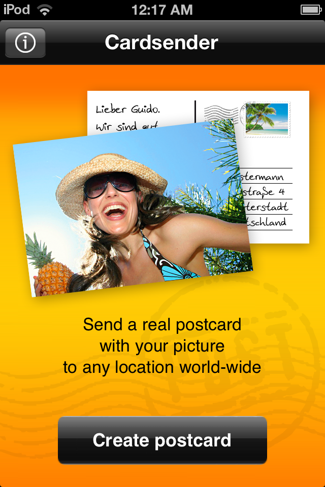
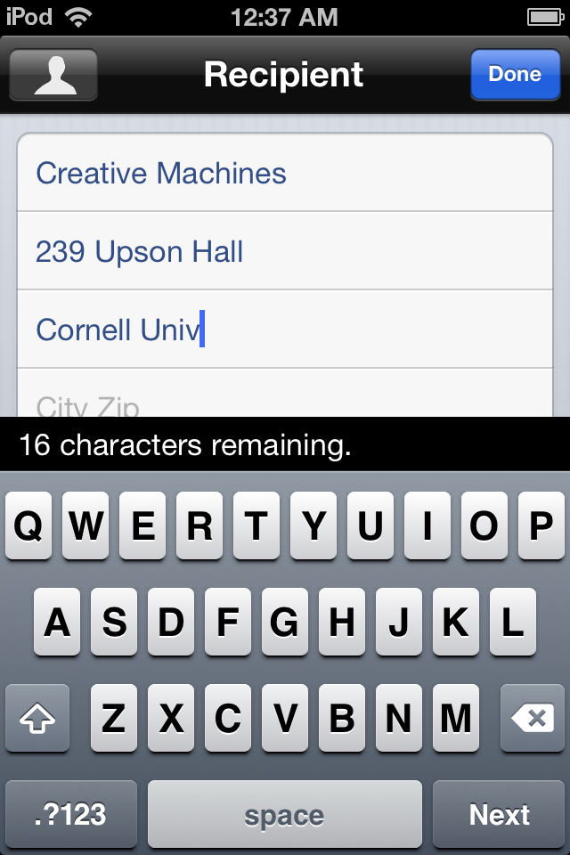

[Kartensender](http://www.kartensender.de) is a smartphone-to-mailbox postcard sending service. During the launch and first few years of operation I worked as its “CTO-for-hire”, writing all server side code and managing technical contractors.

Starting from a German [iPhone app](https://itunes.apple.com/gb/app/kartensender/id316997742?mt=8), Kartensender grew to include [Android](https://play.google.com/store/apps/details?id=de.autoprint.kartensender), [webOS](https://developer.palm.com/appredirect/?packageid=com.autoprint.cardsender), [Windows Phone](http://www.windowsphone.com/de-de/store/app/kartensender/c9c85d8f-6e2f-e011-854c-00237de2db9e) and [web apps](https://www.kartensender.de/web/us/sendpostcard/) in several languages. Add to that tens of white labels and bags of cards sent every day.

