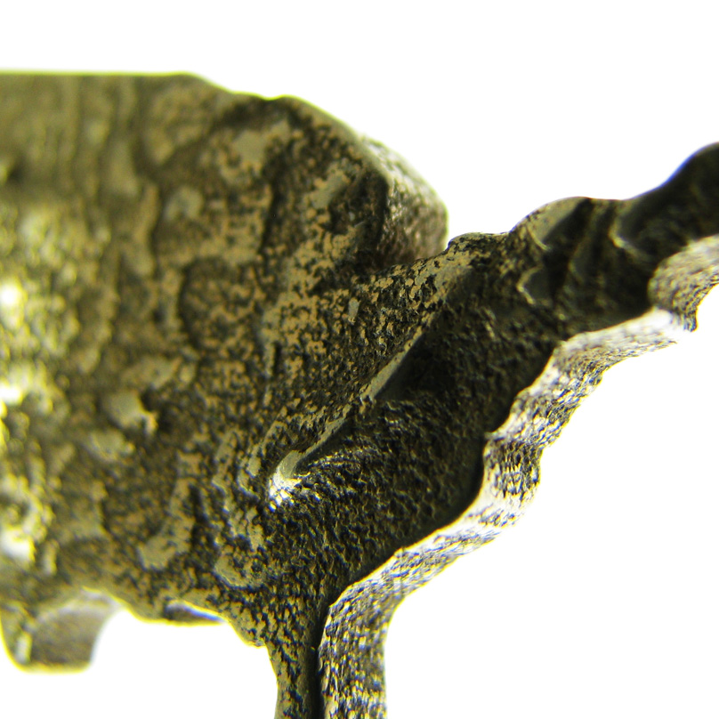
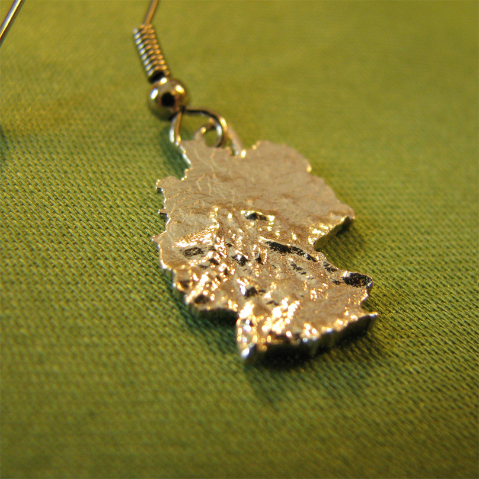
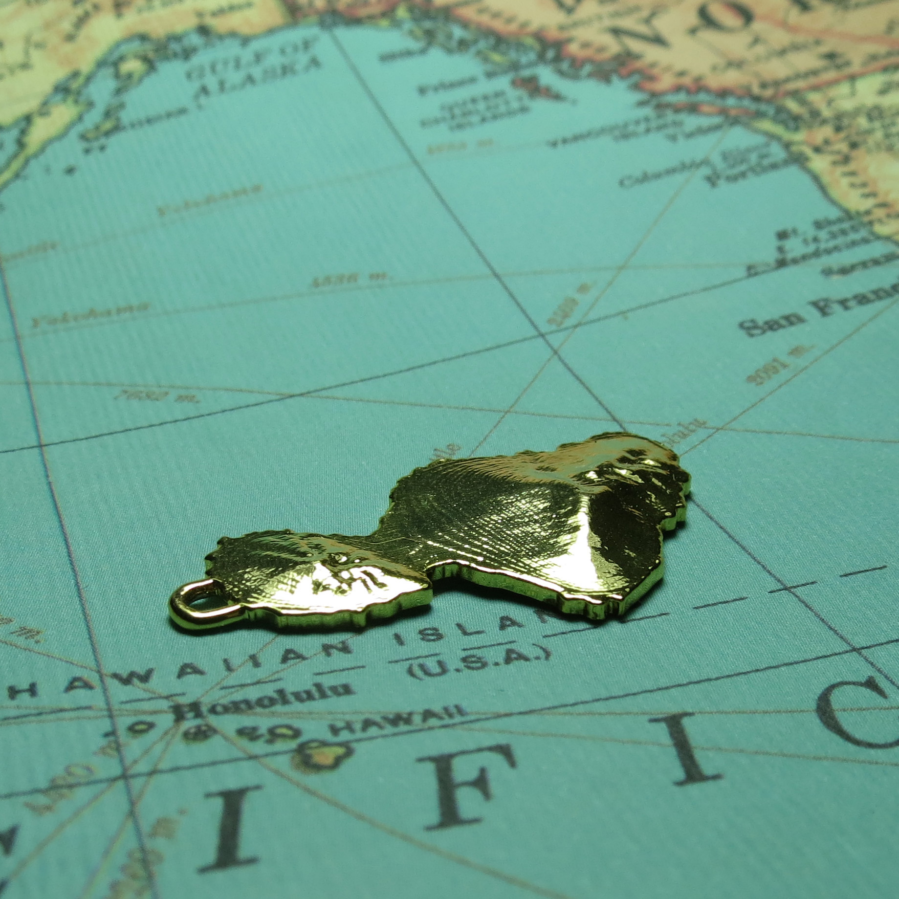
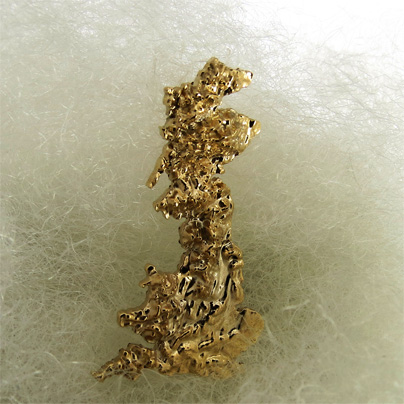

The **Society for Printable Geography** was a project together with [Conny Scheitz](http://corneliascheitz.com/).
Our mission is to use geography as central topic for a creative exploration into the unchartered waters of data driven design, mass customization, and 21st century manufacturing techniques.

Over time this hobby project has grown to include a jewelry collection, a line of country-shaped mirrors, and (most excitingly) an online customization tool for three-dimensional accessories based on geographical terrains from anywhere on earth.

## Links

- [Soc. f. Printable Geography Website](http://www.printablegeography.com)
- [Online Creator for iPhone cases](http://www.printablegeography.com/creator)
- [Printed Geography on Etsy](http://www.etsy.com/shop/geobling)
- [Printed Geography on Shapeways](http://www.shapeways.com/shops/printablegeography)

Tech used:
C++, PHP, webGL, various GIS tools

Mentions:
Wired.com, Forbes.com, Fabbaloo, Thingiverse Blog (twice!)

Traffic:
O(103) visits per month (Sept 2012)

