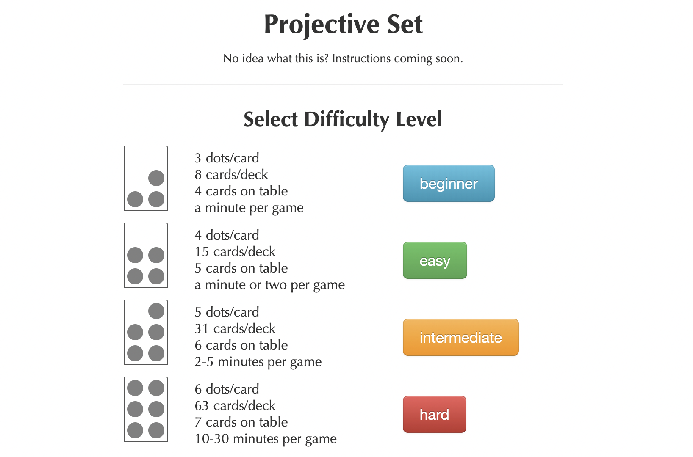
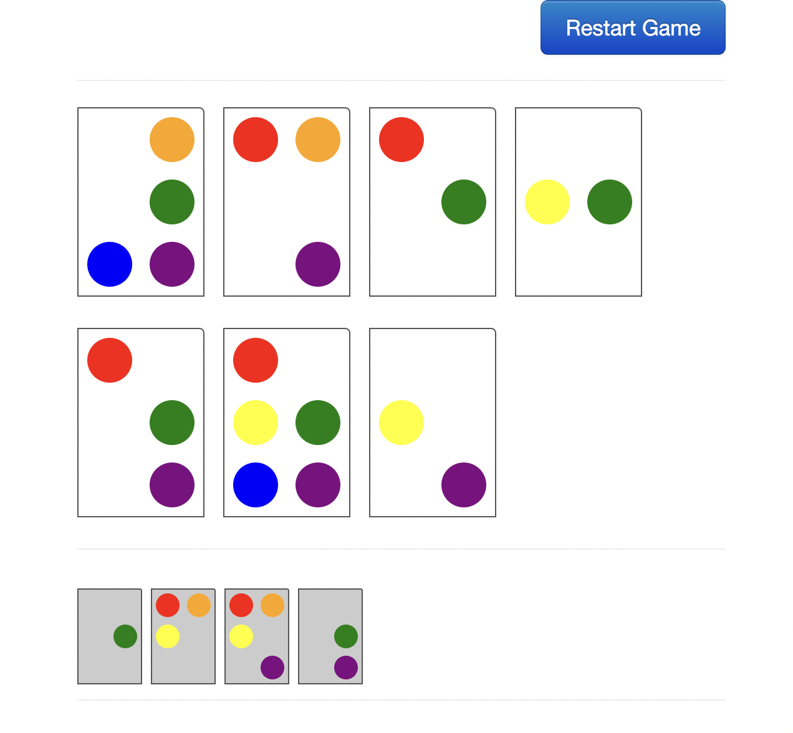

[projectiveset.jonemo.de](http://projectiveset.jonemo.de/)

Around 2010 or 2011 a friend-of-a-friend introduced me to the card game Projective Set.
On Wikipedia, the game is categorized "[recreational mathematics](https://en.wikipedia.org/wiki/Category:Recreational_mathematics)" and explaines as:

> [A] real-time card game derived from the older game [Set](https://en.wikipedia.org/wiki/Set_(game)). The deck contains cards consisting of colored dots; some cards are laid out on the table and players attempt to find "Sets" among them. The word projective comes from the game's relation to [Projective spaces](https://en.wikipedia.org/wiki/Projective_space#Finite_projective_spaces_and_planes) over the [finite field](https://en.wikipedia.org/wiki/Finite_field) with two elements.

If I remember correctly, my quick implementation was the first online version of the game.

The site has been online uninterrupted and without any changes to the original AngularJS 1.2.16 app for a decade and counting, earning it the #1 spot under "External Links" on Wikipedia (as of September 2022).

[Source code on Github](https://github.com/jonemo/ProjectiveSet)

