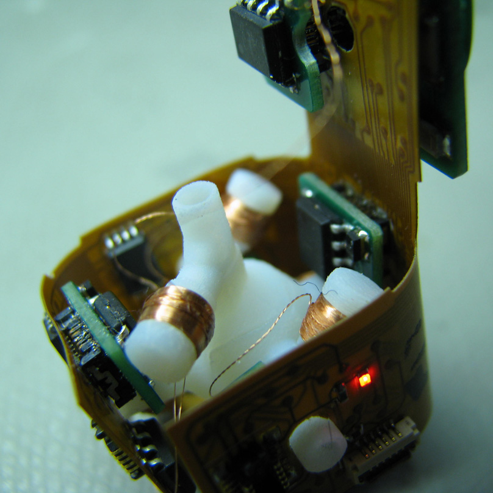

Stochastic Assembly (buzzword: Programmable Matter) was one of the two topics I looked into during my PhD research.

If this project had worked as I had hoped it would, there would only have been a single topic…
You can read about the topic and my small contribution elsewhere.
The following links are probably a good starting point.

- The [project page on our Creative Machines Lab website](http://creativemachines.cornell.edu/stochastic-modular-assembly)
- Neubert, J., Cantwell, A., Constantin, S., Kalontarov, M., Erickson, D., Lipson, H. (2010) “[A Robotic Module for Stochastic Fluidic Assembly of 3D Self-Reconfiguring Structures](http://creativemachines.cornell.edu/sites/default/files/ICRA10-Neubert.pdf)”, Proc. Int. Conf. on Robotics and Automation (ICRA'10), Anchorage AK, May 2010, pp 2479-2484.
- Tolley M. T., Kalontarov M., Neubert J., Erickson D., Lipson H. (2010) "[Stochastic Modular Robotic Systems: A Study of Fluidic Assembly Strategies](http://ccsl.mae.cornell.edu/sites/default/files/T-RO-10-Tolley.pdf)", [**IEEE Transactions on Robotics**](http://ieeexplore.ieee.org/xpls/abs_all.jsp?arnumber=5462863), Vol. 26, pp. 518-530.

The video below (with narration) by my former colleague [Mike Tolley](https://tolley.eng.ucsd.edu) contains a good explanation of what we were up to with this research (but naturally focusses on his work, not mine).



The overarching idea behind the project is described in the below poster which I made for a depertment-internal poster session in 2010.
Here is a high-res [PDF version](ProgrammableMatterPoster2010.pdf).

A few images:

