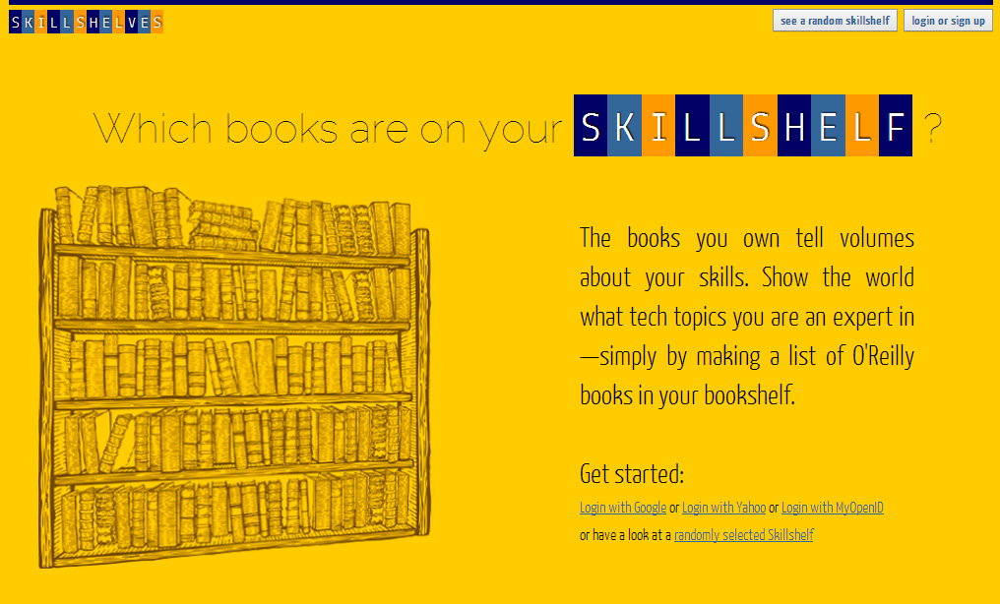

[Skillshelv.es](http://www.skillshelv.es) is was a web application using [Fluidinfo](http://fluidinfo.com)'s (then very) novel globally writable database.
The concept I designed combines a means of skills presentation with a book discovery and won me the second prize of the O'Reilly Fluidinfo API competition (an iPad!)
If you look closely, you will notice that some of the concepts I introduced can now be found in very similar form on O'Reilly Media's website :)

Skillshelv.es was my first experience with Google App Engine, as well as my first confrontation with the challenges of registering a .es domain.
It was also the first time I used yellow as the base color for a website.
You be the judge on how that went.

Unfortunately, I've never had the time and energy to realize the project's potential, and the site certainly hasn't exactly been a blockbuster success.
If you feel that you can do better at running a book discovery website is your calling (tons of Amazon referral credits are just around the corner!), you should get in touch with me.

