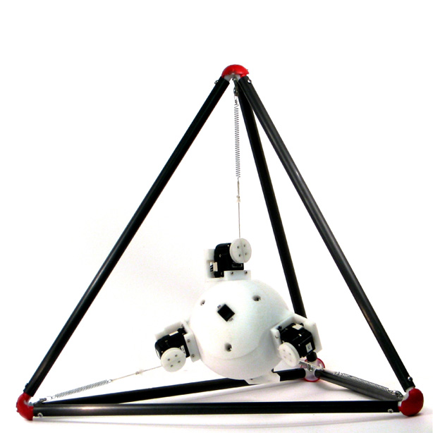
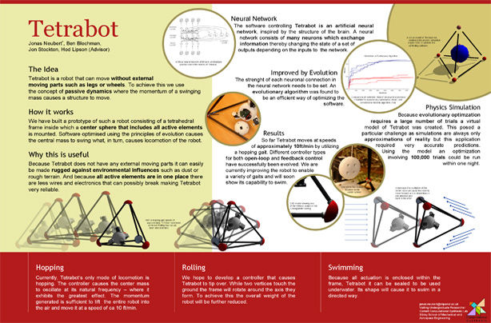
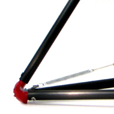
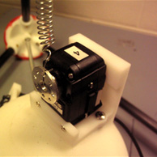
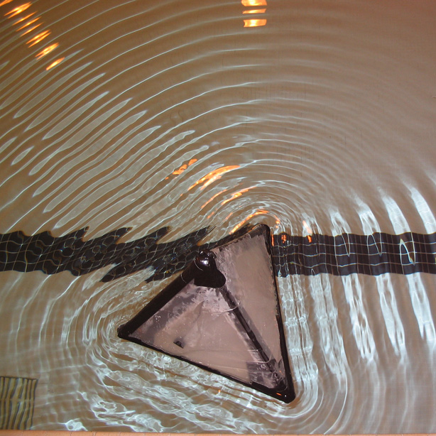

# Tetrabot

A tetrahedral robot with no external moving parts that uses resonance for locomotion

Tetrabot was my research project while visiting the Cornell Computational Synthesis Lab as an undergraduate researcher in summer 2007.

Evidently, I enjoyed that summer a lot. I came back a year later and stayed for five full years to work on my PhD in the same lab.
It's a robot driven by resonance, a condition usually avoided in engineering.

Tetrabot was my first “academic” research project and one aspect of academia I had zero prior exposure to was publishing papers.
After building the robot it took me another two years of follow-on work and writing to get the work accepted at the International Conference on Intelligent Robots and Systems.

Amazingly, even the world of academia that is otherwise famous for preserving ancient web content wasn't able to keep the conference website online.
As of 2021, [no website is listed for IROS 2010](https://www.ieee-ras.org/conferences-workshops/financially-co-sponsored/iros/past-and-future-venues).

Looking back, I am still proud of my first paper even though the magnitude of the scientific work is, well, small.
The fact that I flew half-way around the world to Taipei in order to present about it for 15 minutes to as many attendees, however, seems questionable in hindsight.

**A PDF of the paper is available [here](http://vigir.missouri.edu/~gdesouza/Research/Conference_CDs/IEEE_IROS_2010/data/papers/1551.pdf).**

The poster ([high resolution png](images/tetrabot_poster_large.png)) is a quick summary of the six small-font pages of the paper:

