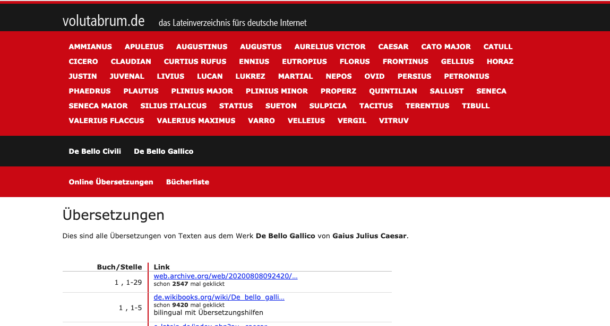

# Volutabrum.de

[Volutabrum.de](http://volutabrum.de) is a directory of German translations of Latin texts.
Sounds like a niche, but isn't.
One third of German high school students take Latin, trending up ([source](https://de.wikipedia.org/wiki/Latein)).
I was one of them, and started this page when I needed it during high school.
For a while it was pretty successful with several 100k visits per year, now it's in maintenance mode.

