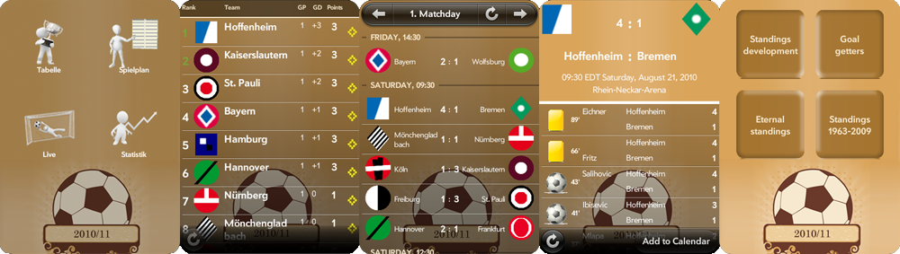

At roughly the same time as when we made the [calculator app for webOS](../calculatorswebos) there was a soccer world cup happening.
As proud owners of one of the first amazing but ultimately ill-fated Palm Pre devices, [Conny](https://www.corneliascheitz.com) and I thought to ourselves:
“We already made a calculator app, how much harder could a live score app for a major international sports event be!?”

Long story short, we figured out a way to build the only 2010 World Cup live score app for webOS on a shoe-string budget.
The most memorable moment of this ridiculous project was when the server went down during a game and one of the co-founders of Palm emailed us asking if we need any help with getting things working again.

The app was free but we ended up winning a small prize in the “Palm webOS Hot Apps Competition”
(one of the ways in which Palm tried to drum up developer interest in their attempt to compete with Apple and Google on app store selection).

After the World Cup was over, we also had Bundesliga and La Liga apps for the better part of a season.

